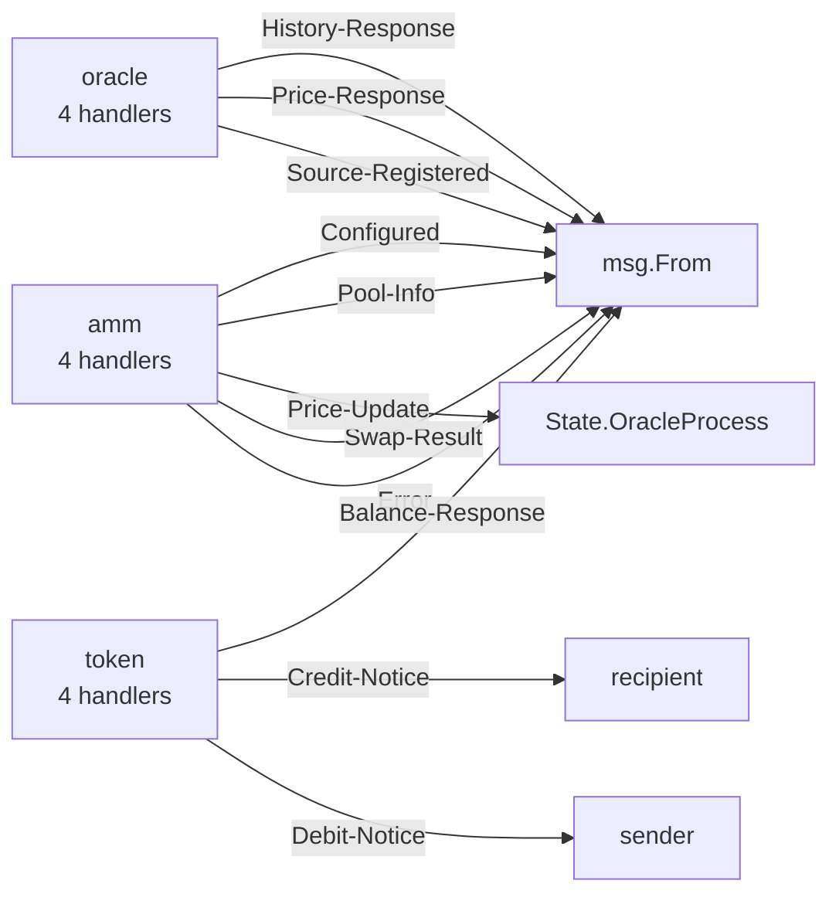

# Visualize Your Multi-Process AO System

## The Problem

AO systems are multi-process. A token talks to an AMM which talks to an oracle. While debugging, you need to trace message flow. Which process sends what action to which target. Reading every `ao.send()` call across 10 files gets old fast.

ao-lens builds an IPC (inter-process communication) topology from your source code. Point it at a directory, get a diagram.

## Example: A DeFi System

Three processes, each in its own file. Here are the relevant `ao.send` calls:

**token.lua** sends `Debit-Notice` to the sender and `Credit-Notice` to the recipient on every transfer.

```lua
ao.send({ Target = sender, Action = "Debit-Notice", ... })
ao.send({ Target = recipient, Action = "Credit-Notice", ... })
```

**amm.lua** receives `Credit-Notice` from the token, executes a swap, sends `Swap-Result` back to the trader and `Price-Update` to the oracle.

```lua
ao.send({ Target = msg.From, Action = "Swap-Result", ... })
ao.send({ Target = State.OracleProcess, Action = "Price-Update", ... })
```

**oracle.lua** receives `Price-Update`, stores price history, and serves `GetPrice` and `GetHistory` queries.

```lua
ao.send({ Target = msg.From, Action = "Price-Response", ... })
ao.send({ Target = msg.From, Action = "History-Response", ... })
```

## Generate the Diagram

```bash
ao-lens graph ./ao/ --mermaid
```

Output:



Paste this into any Mermaid renderer (GitHub markdown, Notion, [mermaid.live](https://mermaid.live)) and you get a visual graph of your entire system.

## What You See

- **Process nodes** show handler counts. A process with 12 handlers is more complex than one with 3. You know where to focus review.
- **Edges** show message actions. Trace the full lifecycle of a swap: `Credit-Notice` into the AMM, `Swap-Result` back to the trader, `Price-Update` out to the oracle.
- **Dynamic targets** like `msg.From` and `State.OracleProcess` show where messages go at runtime. `State.OracleProcess` tells you that target is configurable. It could be nil if nobody called `Configure` first.
- **Missing connections** reveal integration gaps. If the AMM sends `Price-Update` but no process handles it, something is wrong.

## JSON and Summary Formats

```bash
# Machine-readable JSON
ao-lens graph ./ao/ --json

# Quick overview
ao-lens graph ./ao/ --summary
```

The summary for this system: 3 processes, 12 handlers, 11 message flows, 4 distinct target types. Use JSON to build custom visualizations or pipe into other tools.

## Combining with Security Audit

The graph shows message flow. The audit shows vulnerabilities. Use both:

```bash
# What's the architecture?
ao-lens graph ./ao/ --mermaid

# Where are the vulnerabilities?
ao-lens audit ./ao/ --pretty
```

If `amm.lua` sends `Price-Update` to `State.OracleProcess` but never checks if that field is nil, the audit flags `SEND_TARGET_NIL`. The graph shows you why that matters. It's the data pipeline between your AMM and oracle. A nil target means every swap silently drops its price report.

## MCP Server Integration

In Claude Code with the ao-lens MCP server, you can ask:

> "Map the architecture of my ao/ directory and show me which processes communicate"

Claude calls `map_architecture` and renders the topology inline. No copy-pasting, no switching tools.

## Try It

```bash
npx ao-lens graph ./your-ao-dir/ --mermaid
```

Paste the output into [mermaid.live](https://mermaid.live) to see it rendered.

- Example files: [github.com/credentum/ao-lens/tree/main/examples/multi-process](https://github.com/credentum/ao-lens/tree/main/examples/multi-process)
- Full docs: [github.com/credentum/ao-lens](https://github.com/credentum/ao-lens)
